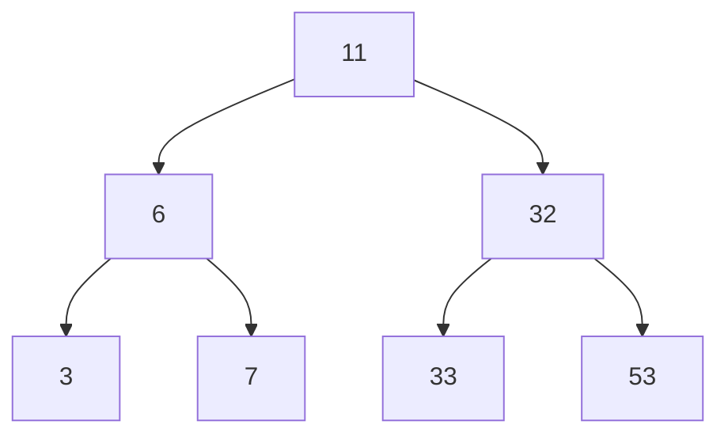

# Serial Search
```pseudocode
// Search for a desired item in the n array elements 
// starting at a[first].  
// Returns pointer to desired record if found.
// Otherwise, return NULL
…
for(i = first; i < n; ++i )
    if(a[first+i] is desired item)
        return &a[first+i];

// if we drop through loop, then desired item was not found
return NULL;
```
# Binary Search
```pseudocode
if(size == 0)
    found = false;
else {
    middle = index of approximate midpoint of array segment;
    if(target == a[middle])
        target has been found!
    else if(target < a[middle])
        search for target in area before midpoint;
    else
        search for target in area after midpoint;
}
```
```C++
void search(const int a[ ], size_t first, size_t size, int target, bool& found, size_t& location)
{
    size_t middle;
    if(size == 0) found = false;
    else {
        middle = first + size/2;
        if(target == a[middle]){
                 location = middle;
                 found = true;
        }
        else if (target < a[middle])   
               // target is less than middle, so search subarray before middle
                search(a, first, size/2, target, found, location);
        else 
              // target is greater than middle, so search subarray after middle
                search(a, middle+1, (size-1)/2, target, found, location);
    }
}
```
## Relation to Binary Search Tree
```
3, 6, 7, 11, 32, 33, 53
```

# Hash Table
- Key
- Value
## Collisions
- 2 keys hash to the same index.
- Find next empty spot.
    - To reduce collisions
        - Use table CAPACITY = prime number of form 4k+3

## Deleting
- Should marked as deleted.
## Hashing Functions
- Division hash function: key % CAPACITY
- Mid-square function: (key*key) % CAPACITY
- Multiplicative hash function: key is multiplied by positive constant less than one. Hash function returns first few digits of fractional result.


| Case | Serial | Binary |
|---|---|---|
| || Sorted |
| Best Case |First Position $ O(1) $| $ O(1) $|
| Worst Case |Last Position/Not Found $ O(n) $| $ O(\log n) $|
| Average Case |$ \frac{(1+2+…+n)}{n} = \frac{(n+1)}{2} $ $ O(n) $| $ O(\log_2 n) $|