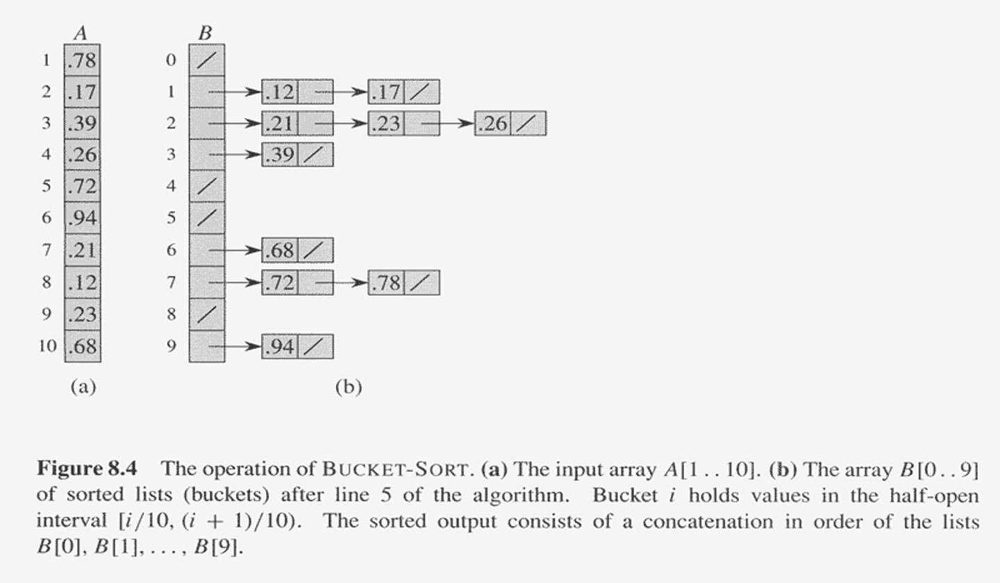

# Sorting
- Input
    - n records
        - A key $ K_i $: total ordering (linear ordering)
            - Trichotomy: For any two keys a and b, exactly one of a  < b, a = b, or a  > b is true.
            - Transitivity: For any three keys a, b, and c, if a  < b and  b  < c, then a  < c.
- Sorting
- Permutation
  

# Insertion Sort
```
INSERTION-SORT (A, n)
    for j ← 2 to n
        do key ← A[j]
            i ← j – 1
            while i > 0 and A[i] > key
                do A[i+1] ← A[i]
                    i ← i – 1
            A[i+1] = key
```
|Line|Times|
|---|---|
|1|$ n $|
|2|$ n - 1 $|
|3|$ n - 1 $|
|4|$ n $|
|5|$ n $|
|6|$ 1 $|
|7|$ O(1) $|
|8|$ O(n) $|

|Case|Time Complexity|
|---|---|
|Best, array is already sorted|$ O(n) $|
|Worst, array is in reverse order|$ O(n^2) $|
|Avg |$ O(n^2) $|

# Shell Sort
# Bubble Sort

# Selection Sort
# Merge Sort (Divide and conquer)
## Divide and conquer
- Divide the problem into sub-problems
- Conquer the sub-problems
- Combine the solutions to create a solution to the original problem
## Merge Sort
- Divide: Divide the n-element sequence to be sorted into two subsequences of n/2 elements each
- Conquer: Sort the two subsequences
- Combine: Merge the two sorted subsequences
## merge two Arrays
- Three counters: Actr, Bctr, and Cctr
- Time: O(m1 + m2) where m1 and m2 are the sizes of the two sub lists.
- mlinear extra memory, additional work to copy to the temporary array and back

# Quick Sort (Divide and Conquer)
- Pick any element (pivot) v in S
    - Pivot: Median of array, better creates two even sized partitions
- Partition S – {v} into two disjoint groups, $x < v$, and $x > v$


# Counting Sort
# Radix Sort
- Sort on the least significant digit first
```
RADIX-SORT(A, d)
    for i ← 1 to d
        do use a stable sort to sort array A on digit i
```

# Bucket Sort
- Bucket sort runs in linear time when the input is drawn from a uniform distribution over the interval [0, 1)
    - Divide [0,1) into n equal-sized subintervals (buckets)
    - Distribute the n numbers into the buckets
    - Sort the numbers in each bucket
    - Go through the buckets in order, list the elements in each

```
BUCKET-SORT(A)
    n ← length[A]
    for i ← 1 to n
        do insert A[i] into list B[⌊nA[i]⌋]
    for i ← 0 to n - 1
        do sort list B[i] with insertion sort
    concatenate the lists B[0], B[1], ..., B[n - 1] together in order
```
As long as the input has the property that the sum of the squares of the bucket size is linear in the total number of elements, bucket sort will run in linear time

| Case | Insertion | Bubble | Selection | Merge | Quick | Counting | Radix | Bucket |
|------|-----------|--------|-----------|-------|-------|----------|-------|--------|
| Best |$ O(1) $| $ O(1) $| $ O(1) $| $ O(n log n) $| $ O(n log n) $| $ O(n + k) $| $ O(nk) $| $ O(n + k) $|
| Worst| $ O(n) $| $ O(n^2) $| $ O(n^2) $| $ O(n log n) $| $ O(n^2) $| $ O(n + k) $| $ O(nk) $| $ O(n^2) $|
| Avg  | $ O(n) $| $ O(n) $| $ O(n^2) $| $ O(n log n) $| $ O(n log n) $| $ O(n + k) $| $ O(nk) $| $ O(n) $|
|Pros|||||Sorts in place efficient quick||||
|Cons|||||Worst case is $O(n^2)$||||