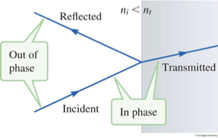
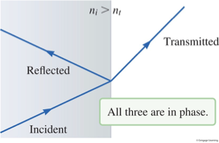
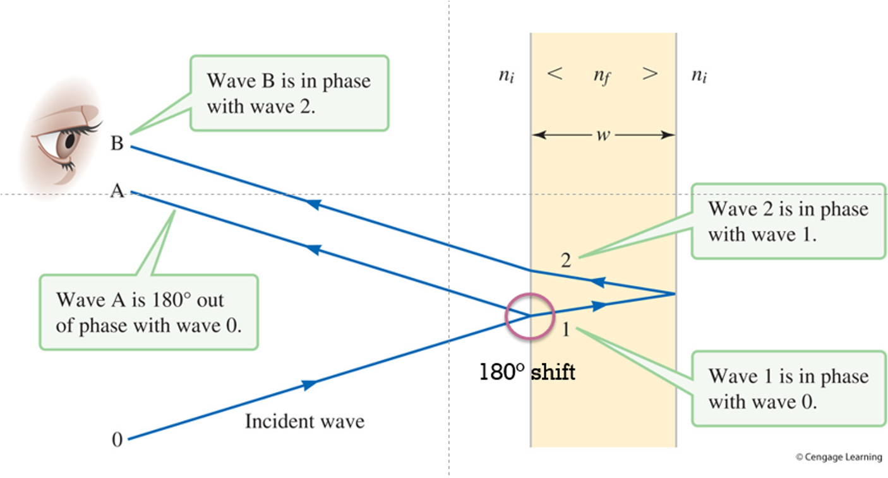

- How do thin films generate interference patterns?
- Application of thin film interference

We’ve just barely started exploring visible light, the part of the electromagnetic spectrum with which we are intimately familiar. 

Electromagnetic waves, with electric and magnetic field oscillations propagating through space, interact with each other and with materials very much like other types of waves. 

Now, in Chapter 36, we’ll apply these concepts to discover ways that physicists have been able to explore the nature of the universe. The stuff of stars leaves a signature in the light radiated into space; diffraction gratings help us understand that better. Crystalline structures of solid materials serve as diffraction gratings of a sort, and by examining ways that light behaves in these structures, we can understand the constitution of the solid. From astronomical scales to the molecular level, applications of the wave model of light uncover for us a better understanding of the universe.

# Refractive Index
The refractive index captures the amount that light is slowed in a medium. This is a dimensionless number that expresses the slowness of light—that seems strange, but it turns out to be a really useful quantity. The higher the refraction index for some material, the slower light waves travel through.

The speed of light comes out of the wave equation built from Faraday’s and Ampere’s laws. 

Similar to dielectric constant

In a vacuum, $ c = \frac{1}{\sqrt{\epsilon_0 \mu_0}} $

In a medium, $ \epsilon = k_\epsilon \epsilon_0 $, $ \mu = k_m \mu_0 $

$ v = \frac{1}{\sqrt{k_\epsilon k_m \mu_0 \epsilon_0}} < c $

Define: index of refraction

$ n = \frac{c}{v} $

Examples:
- Air $ n = 1.0002926 $
- Water $ n = 1.333 $
- Diamond $ n = 2.417 $
however, have an index of refraction greater than 1.

## What happens to wavelength and frequency of a wave, at the boundary?
- Incident
- Refracted
- Transmitted
At the boundary, the electric field oscillates, transverse to the direction of wave propagation. The oscillation in the air will propagate into oscillation in the film, and just a tiny bit on either side of the boundary, that oscillation will be at the same frequency (one causes the other as it propagates). The frequency is the same for the incident wave and the transmitted wave. That means that the wavelength will change. If the wave is slower in the film, the wavelength is shorter. In fact, if the speed is c over n, the wavelength in the medium is the wavelength in vacuum over n. 
- $ n = \frac{c}{v} $
- $ v = \lambda f $

## The index of refraction determines the phase of the reflected wave
The change in speed for the wave is the reason that only part of the wave is transmitted through the boundary, and part is reflected. 

f the wave is coming from a medium with a lower index of refraction, going into a medium with a higher index, the reflection is similar to the reflection of a mechanical wave at a fixed boundary. Right at the fixed boundary, there is zero displacement. We can ensure that zero displacement by thinking of the incoming wave superimposed with the reflected wave, adding to zero. That requires the reflected wave to be 180 degrees out of phase, which results in an inverted reflection on this string. For the light wave, there’s a similar phase shift of 180 degrees, so the reflected wave is out of phase with the incident wave.

Now, if the boundary is the other way, so that the incident wave is in a medium with a higher index of refraction, the wave is moving from a slower medium to a faster medium. The transmitted wave is, if you will, freer to move; the analogous mechanical boundary is an end that’s free to move—like a ring sliding up and down the post. Again, there is a reflection, but in this case, that free boundary has constructive interference, and the reflected wave is in phase with the incident wave, or on the string, reflected upright in the same direction as the incident wave. Thus, for the light wave, all three waves—the incident, transmitted, and reflected waves—are in phase.

Several transmissions and reflections in a thin film set up two waves that reach an observer

## Several transmissions and reflections in a thin film set up two waves that reach an observer

## Constructive interference between reflected waves accounts for path and phase differences
The two waves, A and B, that reach the observer can interfere constructively if they arrive in phase. 

There is a path difference because wave B needed to travel as wave 1 and wave 2, traversing the width of the film forth and back. 

There’s also a difference because wave A had a 180-degree phase shift upon reflection, while the reflection from the right side of the film did not have a phase shift. 

That difference from the reflections is equivalent to a half wavelength of path difference. The total difference between waves A and B is then 2w minus a half wavelength.

If we set that total difference equal to an integer number of wavelengths, m times lambda, we arrive at an equation for the condition of constructive interference. Twice the thickness of the thin film must be equal to m plus half wavelengths. In other words, 2w could be half a wavelength, three-halves, five-halves, and so on. 
- Path difference: $ \Delta d = 2w $
- Phase difference: $ 180^\circ \text{ or } \frac{\lambda}{2} $
- Combined: $ \Delta d = 2w - \frac{\lambda}{2} = m\lambda $
- Constructive interference: $ 2w = (m + \frac{1}{2})\lambda, m = 0, \pm 1, \pm 2, \ldots $
- Destructive interference: 
    - $ 2w - \frac{\lambda}{2} = (m+\frac{1}{2})\lambda $
    - $ 2w = (m + 1)\lambda $
    - $ 2w = m\lambda, m = 0, \pm 1, \pm 2, \ldots $
## Which wavelength?
- $ \lambda_{air} or \lambda_{film}$?
- $ f $ is the same for all wavelengths
- $ \lambda = \frac{v}{f} $
- $ v_{air} = c $, $ v_{film} = \frac{c}{n} $

The extra path length traveled by wave 2 is traveled in the film medium, where the wave moves more slowly and the wavelength is longer. Therefore, when we’re talking about setting the conditions for constructive interference, we need to use $ \lambda_{film} $, the wavelength in the film.
## Constructive interference and destructive interference can happen with a thin film
Finally, to summarize, the combined difference of twice the film width, adding the 180-degree phase shift, can be set equal to an integer number of wavelengths to give us constructive interference. That wavelength needs to be the wavelength in the material of the film, because that’s where the path difference of 2w happens. 
The combined difference can also be set equal to an integer plus half a wavelength, if we wish to find a condition for destructive interference. In that case, notice that the extra path of two times the width is equal to an integer number of wavelengths—this might remind us of the condition for constructive interference, but remember that 180-degree phase shift at one reflection, which then would make this into perfectly destructive interference. 

Did you catch the interesting trick of integers in the number of wavelengths for the destructive case? If we have 2w equal to (m + 1) wavelengths, that’s equivalent to m wavelengths. Shifting a sine or cosine wave by a complete wavelength gives us a result that’s undetectably different, practically speaking. 
