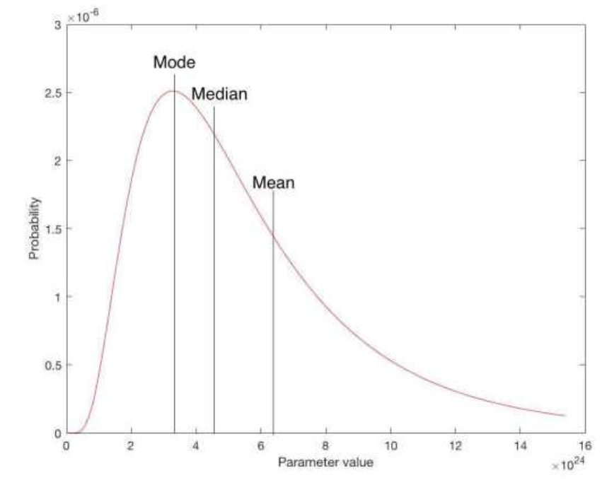
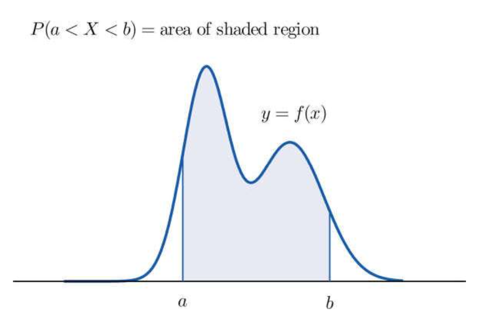

# 4.1 Random Variables
- Random Variables: A real-valued function defined on a sample space. 
$ X = Number of heads in 3 tosses of a coin $
- Probability Distribution: $ P(X = x) $ 
    - X is random variable
    - x is a observed value.

|x|0|1|2|3|
|---|---|---|---|---|
|$P(X = x)$|0.125|0.375|0.375|0.125|

# 4.2 Discrete Random Variables
- Probability Mass Function (PMF): $ p(x) = P(X = x) $
    - $ p(x) \geq 0 $
    - $ \sum p(x) = 1 $
$ \sum p(x) = 1 $
- Cumulative Distribution Function (CDF): $ F(x) = P(X \leq x) = \sum_{t \leq x} p(t) $
    - $ F(x) \geq 0 $
    - $ F(x) \leq 1 $
    - $ F(x) $ is non-decreasing

# 4.2 Expected Value
For discrete random variables:
- Expectation/Expected Value: $ E(X) = \sum_{x} x p(x) $

# Expectation of a Function of a Random Variable
For discrete random variables:
- $ E[g(X)] = \sum_{x} g(x) p(x) $
- Mean: $ E[X] = \mu $ $ 1^{st} $ moment of X
- $ g(x) = x^2 $ $ 2^{nd} $ moment of X
    - $ E[X^2] = \sum_{x} x^2 p(x) $
- $ g(x) = ax + b $
    - $ E[g(X)] = aE[X] + b $

$ E[X^2 - X] = \sum_{x} (x^2 - x) p(x) = E[X^2] - E[X] $

# 4.5 Variance
For discrete random variables:
- Variance: $ Var(X) = E[(X - \mu)^2] = \sum_{x} (x - \mu)^2 p(x) = E[X^2] - (E[X])^2 $
- $ Var(aX + b) = a^2 Var(X) $
- Standard Deviation: $ \sigma = \sqrt{Var(X)} $

# 4.6 Bernoulli and Binomial Random Variables
## Bernoulli
|Outcome|0|1|
|---|---|---|
|x|0|1|
|X|$1-p$|$p$|

## Binomial
- $ X \sim Bin(n, p) $
    - $ E[X] = np $
    - $ Var(X) = np(1-p) $
- $ X = Number\ of\ successes$ in $n$ Bernoulli trials
- $ P(X = x) = \binom{n}{x} p^x (1-p)^{n-x}, n = 0, 1, 2, \ldots$

# 4.7 Poisson Random Variables
- $ X \sim Poi(\lambda) $
    - $ E[X] = \lambda $
    - $ Var(X) = \lambda $
- $ X = Number\ of\ successes$ in a fixed interval of time or space
- $ P(X = x) = \frac{\lambda^x e^{-\lambda}}{x!}, x = 0, 1, 2, \ldots \lambda > 0$
## Poisson Approximation to the Binomial
$ X \sim Bin(n, p) $
If $ n $ is large and $ p $ is small, rare events, then:
$ \lambda = np $
- Number of misprints in a book
- Number of phone calls received in an hour

## Number of Events Occurring in a Time Interval
Length of time $ t $
- A store serves $ 15 $ customers per hour. What is the probability that $ 5 $ customers will be served in $ 1 $ minutes?
$ \lambda = 15 \times \frac{1}{60} = 0.25 $\
$ P(X = 5) = \frac{0.25^5 e^{-0.25}}{5!} \approx 0.0184 $

# 5.1 Continuous Random Variables
- Probability Density Function (PDF): $ f(x) $
    - $ f(x) \geq 0 $
    - $ \int_{-\infty}^{\infty} f(x) dx = 1 $
    - $ P(X = x) = 0 $
    - $ P(a \leq X \leq b) = \int_{a}^{b} f(x) dx $

- Cumulative Distribution Function (CDF): $ F(x) = P(X \leq x) = \int_{-\infty}^{x} f(t) dt $
    - $ dF(x) = f(x) dx $
    - $ P(a \leq X \leq b) = P(a < X < b) = P(a < X \leq b) = P(a \leq X < b) = F(b) - F(a) $

# 5.2 Expected Value
For continuous random variables:
- $ E[X] = \int_{-\infty}^{\infty} x f(x) dx $
- $ E[g(X)] = \int_{-\infty}^{\infty} g(x) f(x) dx $
- Variance: same as discrete

# 5.3 Uniform Random Variables
- $ X \sim Unif(a, b) $
- $ f(x) = \frac{1}{b-a}, a \leq x \leq b $
- $ f(x) = 0, \text{ otherwise} $
- $ E[X] = \frac{a + b}{2} $
- $ Var(X) = \frac{(b-a)^2}{12} $
- Cumulative Distribution Function (CDF): 
    - $ \frac{x-a}{b-a}, a \leq x \leq b $
    - $ 0, x < a $
    - $ 1, x > b $

Bus arrive at 7:00, 7:13, 7:30, 7:45. X is uniformly distributed between 0 and 30 minutes.Find the probability that he waits less than 5 mins.\
$ P(10 < X < 15) + P(25 < X < 30) = \int_{10}^{15} f(x) dx + \int_{25}^{30} f(x) dx $

# 5.4 Normal Random Variables
- $ X \sim N(\mu, \sigma^2) $
    - $ E[X] = \mu $
    - $ Var(X) = \sigma^2 $
- $ f(x) = \frac{1}{\sqrt{2\pi\sigma^2}} e^{-\frac{(x-\mu)^2}{2\sigma^2}}, -\infty < x < \infty $
- Standard Normal Distribution: $ Z \sim N(0, 1) $
    - $ \phi(z) = \frac{1}{\sqrt{2\pi}} e^{-z^2/2}, \quad -\infty < z < \infty $
    - Cumulative Distribution Function (CDF):$ \Phi(z) = \frac{1}{\sqrt{2\pi}} \int_{-\infty}^{z} e^{-t^2/2} dt $
- Find Normal Distribution Probabilities: 
    - For $ X \sim N(\mu, \sigma^2) $
    - $ Z = \frac{X - \mu}{\sigma} \sim N(0, 1) $

$ X \sim N(3, 9) $\
$ P(2 < X < 5) = P\left(\frac{2 - 3}{\sqrt 9} < \frac{x - \mu}{\sigma} < \frac{5 - 3}{\sqrt 9}\right) = P(-0.33 < Z < 0.67) = P(Z < 0.67) - P(Z < -0.33) $

- $ X \sim N(\mu, \sigma^2) $
- $ Y = aX + b \sim N(a\mu + b, a^2\sigma^2) $
    - $ E[Y] = aE[X] + b = a\mu + b $
    - $ Var(Y) = a^2 Var(X) = a^2 \sigma^2 $

$ P(X \leq 65) = P(X > 64.5) $
## Normal Approximation to the Binomial
- If $ n $ is large and $ p $ is not too close to 0 or 1, then:
$ X \sim Bin(n, p)$\
$ N(np, np(1-p)) $

# 5.5 Exponential Random Variables
- $ X \sim Exp(\lambda) $
    - $ f(x) = \lambda e^{-\lambda x}, x \geq 0 $
    - $ f(x) = 0, x < 0 $
- CDF
    - $ F(x) = 1 - e^{-\lambda x}, x \geq 0 $
    - $ F(x) = 0, x < 0 $
- $ E[X] = \frac{1}{\lambda} $
- $ Var(X) = \frac{1}{\lambda^2} $
- Memoryless Property: $ P(X > s + t | X > s) = P(X > t) $

Suppose that the number of miles that a car can run before its battery wears out is exponentially distributed with an average value of 10000 miles. If a person desires to take a 5000-mile trip, what is the probability that he or she will be able to complete the trip without having to replace the car battery?

  - X = number of miles a car can run before its battery wears out
  - $ X \sim \text{Exp}\left(\frac{1}{10000}\right) $
  - $ E(X) = 10000 = \frac{1}{\lambda} $
  - $ \lambda = \frac{1}{10000} $

 - $ P(X > 5000 + s \mid X > s) = P(X > 5000) = 1 - P(X \leq 5000) = 1 - F(5000) $