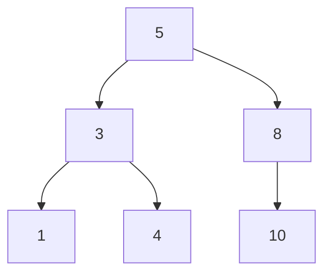

- Height of a null tree is: -1
- A binary search tree where the height of the two subtrees of a node differs by at most one
- Nodes: $S(h) = L(h) + R(h) + 1$
- searching: $O(log n)$
- findMin: $O(log n)$
- insertion: $O(log n)$
    - search for the node
    - if not found, insert it
    - Tree Rotations used to restore the balance.

||searching|findMin|deletion|insertion|
|---|---|---|---|---|
|$O(log n)$|$O(log n)$|$O(log n)$|$O(log n)$|$O(log n)$|