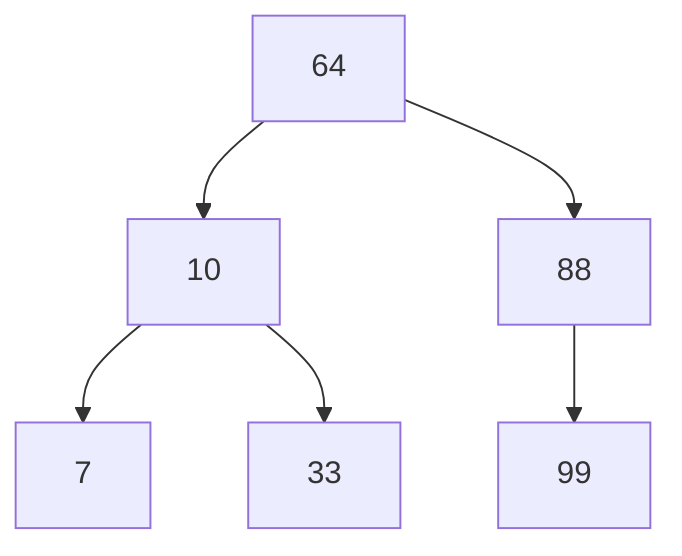

- Root
- Internal Nodes
- Leaf
- Sibling: Same parent

# Traverse BST

- NLR (Preorder): ??? = 64 10 7 33 88 99
- LNR (Inorder): ??? = 7 10 33 64 88 99
- LRN (Postorder): ??? = 7 33 10 99 88 64
# Binary Search Trees
## Insert
## Delete
3 cases:
1. Leaf: Set parent to null
2. 1 child: Set parent to child
3. 2 children

|Operation|Time Complexity|
|---|---|
|Insert|$O(h)$|
|Delete|$O(h)$|
|Search|$O(h)$|
