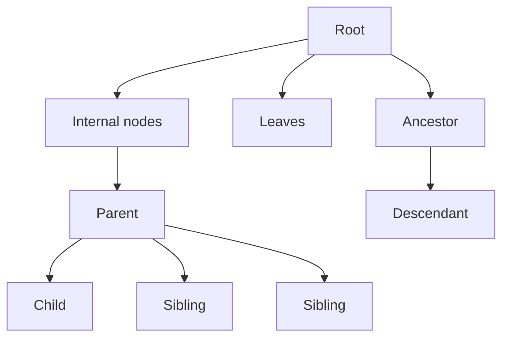
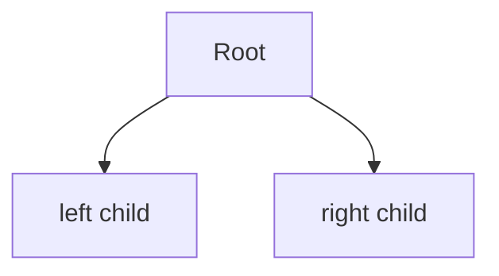
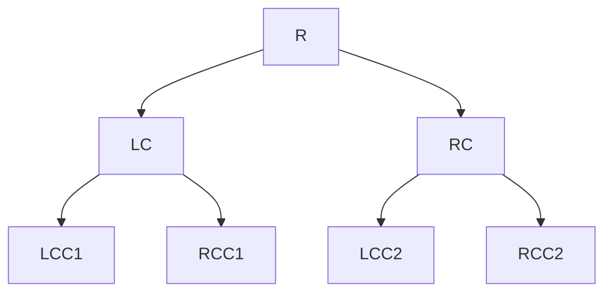
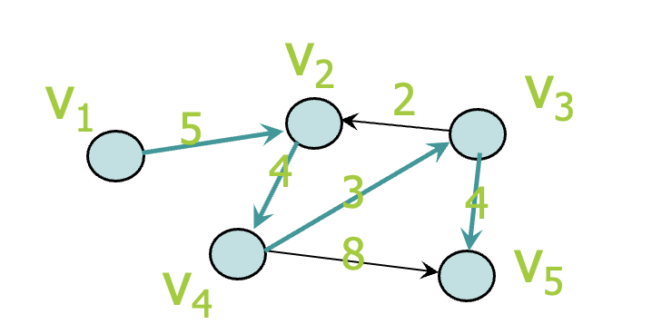

# Trees
- A tree
    - nodes
    - edges (u, v)

- Level: Level 1, Level 2
- Height: Height = 2
## Binary Tree

- Each node has at most two children
    - $ n \leq 2^h - 1 $
    - $ h \geq \log_2(n + 1) $
- Full binary tree: Every node has either 0 or 2 children
    - Nodes at level i: $ 2^i $
    - Total nodes: $ 2^{h} - 1 $

- getElem
- Representation
    - Array-Based
        - index, item, left, right
    - Reference-Based

## Tree Traversal
- Pre-order (prefix)
    - $ R \rightarrow LC \rightarrow LCC1 \rightarrow RCC1 \rightarrow RC \rightarrow LCC2 \rightarrow RCC2 $
    - visit node
    - recursively visit left subtree
    - recursively visit right subtree
- In-order (infix)
    - $ LCC1 \rightarrow LC \rightarrow RCC1 \rightarrow R \rightarrow LCC2 \rightarrow RC \rightarrow RCC2 $
    - recursively visit left subtree
    - visit node
    - recursively visit right subtree
- Post-order (postfix)
    - Can be computed efficiently using stack
    - $ LCC1 \rightarrow RCC1 \rightarrow LC \rightarrow LCC2 \rightarrow RCC2 \rightarrow RC \rightarrow R $
    - recursively visit left subtree
    - recursively visit right subtree
    - visit node
- Level-order
    - $ R \rightarrow LC \rightarrow RC \rightarrow LCC1 \rightarrow RCC1 \rightarrow LCC2 \rightarrow RCC2 $
    - Traverse the nodes level by level

||Pre-order|In-order|Post-order|Level-order|
|---|---|---|---|---|
|Recursive|$\checkmark$|$\checkmark$|$\checkmark$|$\times$|
|Time|$O(n)$ For every node x, we will call pre-order(x) one time, which performs O(1) operations.|Same as Pre-order|Same as Pre-order|$O(n)$ Each node will enqueue and dequeue one time. For each node dequeued, it only does one print operation!|
# Summary
- We have discussed 
    - the tree data-structure.
    - Binary tree vs general tree
    - Binary tree ADT
        - Can be implemented using arrays or references
    - Tree traversal
        - Pre-order, in-order, post-order, and level-order

# Graphs
- Graphs: $ G = (V, E) $
    - Vertices: $ V = {v1, v2, ..., vn} $
    - Edges: $ E = {(u, v), ...} $
- Adjacency: $ (u, v) \in E $
- Path: A sequence of vertices $ v_1, v_2, ..., v_k $ such that $ (v_i, v_{i+1}) \in E $
    - Simple path: No repeated vertices
- Cycle: A path that starts and ends at the same vertex
    - Simple cycle: No repeated vertices except the starting and ending vertex.
- Connected graph: There is a path between every pair of vertices.
- Connected component: Compose a disconnected graph.
- Complete graph: Every pair of vertices is connected by an edge.
- Subgraph
- Weighted graph
- Directed graph
    - $ x \rightarrow y $
        - y is adjacent, successor, predecessor of x
- Multigraph: Multiple edges and self edges/loops.
- A undirected graph that is connected and has no cycle is a tree.
- A tree with n nodes have exactly n-1 edges.
- A connected undirected graph with n nodes must have at least n-1 edges.

|Implementation|Adjacency Matrix|Adjacency List|
|---|---|---|
|Directed|$ A[i][j] = 1 $ if $ (v_i, v_j) \in E $|$ A[v_i] = {v_j | (v_i, v_j) \in E} $|
|Weighted Directed|$ A[i][j] = w $ if $ (v_i, v_j) \in E $|$ A[v_i] = {(v_j, w) | (v_i, v_j) \in E} $|
|Pros|determine whether there is an edge from node i to node j in O(1) time|find all nodes adjacent to a given node j efficiently, If the graph is sparse, adjacency list requires less space|

|Graph Traversal|Depth-first-search (Pre-order)|Breadth-first-search (Level-order)|
|---|---|---|
|Description|explores deeply into the graph|explores every node adjacent to v|
|Implementation|Queue|Queue|

- Topological Sort
- Spanning Tree
- Minimum Spanning Tree

## Dijkstra's Algorithm: to find Shortest Path

| v | VS |$ cost[v_1] $|$ cost[v_2] $|$ cost[v_3] $|$ cost[v_4] $|$ cost[v_5] $|
|----|-------------|----------|----------|----------|----------|----------|
| 1  |$ [v_1] $| 0 | 5 |  |  |  |
| 2  |$ [v_1, v_2] $| 0 | 5 |  | 9 |  |
| 3  |$ [v_1, v_2, v_4] $| 0 | 5 | 12 | 9 | 17 |
| 4  |$ [v_1, v_2, v_4, v_3] $| 0 | 5 | 12 | 9 | 16 |
| 5  |$ [v_1, v_2, v_4, v_3, v_5] $| 0 | 5 | 12 | 9 | 16 |
# Summary
- Graphs can be used to represent many real-life problems. 
- There are numerous important graph algorithms.
- We have studied some basic concepts and algorithms. 
    - Graph Traversal
    - Topological Sort
    - Spanning Tree
    - Minimum Spanning Tree
    - Shortest Path
