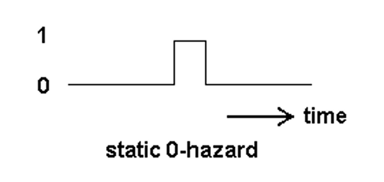

# Summary
- Combinational logic circuit
- Adder
- Comparator
- Decoder
- Encoder
- Mux and Demux
- Hazard
    - Static 1
    - Static 0
    - Dynamic
    - Elimination of hazard using K-maps

# Combinational Logic Circuits
- **Output is function of input only**
    - no memory
    - no feedback
    - When input changes, output may change (after a delay)
- $ n \text{ inputs } \rightarrow m \text{ outputs } $

## Analysis
- Given circuit, find function. 
- Function may be expressed as:
    - Boolean function
    - Truth table
## Design
- Given function, determine circuit. 
- Function may be expressed as:
    - Boolean function
    - Truth table
- Procedure:
    - Determine the number of inputs and outputs
    - Derive the truth table
    - Simplify the Boolean expression for each output
    - Produce the required circuit

$ (A + B + C) \cdot (A' + B') \cdot (A' + C') \cdot (B' + C') = A \cdot B' \cdot C' + A' \cdot B \cdot C' + A' \cdot B' \cdot C $

# Adder
## Binary Adder
### Half Adder
- Gate
    - XOR gate
    - AND gate
- Input
    - 1-bit 
    - 1-bit
- Output
    - Sum: $S = A \oplus B$
    - Carry: $C = A \cdot B$

|$A$|$B$|$C$|$S$|
|---|---|---|---|
|$0$|$0$|$0$|$0$|
|$0$|$1$|$0$|$1$|
|$1$|$0$|$0$|$1$|
|$1$|$1$|$1$|$0$|

### Full Adder
- Input
    - 1-bit
    - 1-bit
    - Carry-in
- Output
    - Sum: $S = A \oplus B \oplus C_{in}$
    - Carry-out: $C_{out} = A \cdot B + B \cdot C_{in} + A \cdot C_{in}$
    - $S = xy'z'+x'yz'+x'y'z+xyz = x \oplus y \oplus z$
    - $C = xy + yz + xz$
- Can use 2 Half Adders

|$A$|$B$|$C_{in}$|$C_{out}$|$S$|
|---|---|---|---|---|
|$0$|$0$|$0$|$0$|$0$|
|$0$|$0$|$1$|$0$|$1$|
|$0$|$1$|$0$|$0$|$1$|
|$0$|$1$|$1$|$1$|$0$|
|$1$|$0$|$0$|$0$|$1$|
|$1$|$0$|$1$|$1$|$0$|
|$1$|$1$|$0$|$1$|$0$|
|$1$|$1$|$1$|$1$|$1$|
### Binary Parallel Adder
- To add binary numbers with more than one bit, additional full-adders are needed.
- When one binary number is added to another, each column generates a sum bit and a 1 or 0 carry bit to the next column to the left, as illustrated here with 2-bit numbers.
- $C_{in} \rightarrow C_{out}$

## Carry Look-ahead Adder
- The speed with which an addition can be performed is limited by the time required for the carries to propagate through all the stages of a parallel adder. 
- One method of speeding up the addition process by eliminating this ripple carry delay is called **look-ahead carry** addition. 
- The look-ahead carry adder anticipates the output carry of each stage, and based on the inputs, produces the output carry by either **carry generation** or **carry propagation**.
- **Carry Generation**
    - Occurs when an output carry is produced internally by the full-adder. 
    - A carry is generated only when both input bits are 1s. 
    - The generated carry, Cg, is expressed as the AND function of the two input bits, A and B.
    - $Cg = A \cdot B$
- **Carry Propagation**
    - occurs when the input carry is rippled to become the output carry. 
    - An input carry may be propagated by the full-adder when either or both of the input bits are 1s. 
    - The propagated carry, Cp, is expressed as the OR function of the input bits. 
    - $Cp = A \oplus B$
- The output carry of a full-adder: $C_{out} = Cg + (Cp \cdot C_{in})$

# Comparator
## Magnitude Comparator
- To compare the magnitudes of two binary quantities to determine the relationship of those quantities
- - In order to compare binary numbers containing two bits each, an additional XNOR gate is necessary. The two least significant bits (LSBs) of the two numbers are compared by gate G1, and the two most significant bits (MSBs) are compared by gate G2, as shown in Figure 6–19. If the two numbers are equal, their corresponding bits are the same, and the output of each exclusive-NOR gate is a 1. If the corresponding sets of bits are not equal, a 0 occurs on that exclusive-NOR gate output. 
### Compare 4-bit number to 4-bit number
- $x_3 = \overline{A_3} \ \overline{B_3} +  A_3 B_3$
- $x_2 = \overline{A_2} \ \overline{B_2} +  A_2 B_2$
- $x_1 = \overline{A_1} \ \overline{B_1} +  A_1 B_1$
- $x_0 = \overline{A_0} \ \overline{B_0} +  A_0 B_0$
- $(A = B) = x_3 \ x_2 \ x_1 \ x_0$
- $(A > B) = A_3 \ \overline{B_3} + x_3 \ A_2 \ \overline{B_2} + x_3 \ x_2 \ A_1 \ \overline{B_1} + x_3 \ x_2 \ x_1 \ A_0 \ \overline{B_0}$
- $(A < B) = \overline{A_3} \ B_3 + x_3 \ \overline{A_2} \ B_2 + x_3 \ x_2 \ \overline{A_1} \ B_1 + x_3 \ x_2 \ x_1 \ \overline{A_0} \ B_0$

### Compare 3-bit number to 3-bit number
- $x_2 = \overline{A_2} \ \overline{B_2} +  A_2 B_2$
- $x_1 = \overline{A_1} \ \overline{B_1} +  A_1 B_1$
- $x_0 = \overline{A_0} \ \overline{B_0} +  A_0 B_0$
- $(A = B) = x_2 \ x_1 \ x_0$
- $(A > B) = A_2 \ \overline{B_2} + x_2 \ A_1 \ \overline{B_1} + x_2 \ x_1 \ A_0 \ \overline{B_0}$
- $(A < B) = \overline{A_2} \ B_2 + x_2 \ \overline{A_1} \ B_1 + x_2 \ x_1 \ \overline{A_0} \ B_0$

# Decoder
- Extract “Information” from the code
    - Example: 2-bit Binary Number
    - $N$ – input and $2^N$- Output 
    - For $N$ inputs, only $1$ output will be active
## Binary (2-to-4 Line) Decoder

|$E$(“Enable” Control)|$I_1$|$I_0$|$Y_3$|$Y_2$|$Y_1$|$Y_0$|
|---|---|---|---|---|---|---|
|$0$|$x$|$x$|$0$|$0$|$0$|$0$|
|$1$|$0$|$0$|$0$|$0$|$0$|$1$|
|$1$|$0$|$1$|$0$|$0$|$1$|$0$|
|$1$|$1$|$0$|$0$|$1$|$0$|$0$|
|$1$|$1$|$1$|$1$|$0$|$0$|$0$|
- $Y_3 = I_1 \cdot I_0$
- $Y_2 = I_1 \cdot \overline{I_0}$
- $Y_1 = \overline{I_1} \cdot I_0$
- $Y_0 = \overline{I_1} \cdot \overline{I_0}$
## 3-to-8 Line Decoder
- $Y_7 = I_2 \cdot I_1 \cdot I_0$
- $Y_6 = I_2 \cdot I_1 \cdot \overline{I_0}$
- $Y_5 = I_2 \cdot \overline{I_1} \cdot I_0$
- $Y_4 = I_2 \cdot \overline{I_1} \cdot \overline{I_0}$
- $Y_3 = \overline{I_2} \cdot I_1 \cdot I_0$
- $Y_2 = \overline{I_2} \cdot I_1 \cdot \overline{I_0}$
- $Y_1 = \overline{I_2} \cdot \overline{I_1} \cdot I_0$
- $Y_0 = \overline{I_2} \cdot \overline{I_1} \cdot \overline{I_0}$
## BCD to Decimal Decoder
|Decimal Digit|$I_3$|$I_2$|$I_1$|$I_0$|Decoding Function|
|---|---|---|---|---|---|
|$0$|$0$|$0$|$0$|$0$|$\overline{I_3} \cdot \overline{I_2} \cdot \overline{I_1} \cdot \overline{I_0}$|
|$1$|$0$|$0$|$0$|$1$|$\overline{I_3} \cdot \overline{I_2} \cdot \overline{I_1} \cdot I_0$|
|$9$|$1$|$0$|$0$|$1$|$I_3 \cdot \overline{I_2} \cdot \overline{I_1} \cdot I_0$|
## Active-High / Active-Low
- Active-High
    - $I_1, I_0 \rightarrow Y_3, Y_2, Y_1, Y_0$
- Active-Low
    - $I_1, I_0 \rightarrow \overline{Y_3}, \overline{Y_2}, \overline{Y_1}, \overline{Y_0}$
# Encoder
- Put “Information” into code
    - $2^N$- input and $N$ – output
    - For $2^N$ inputs, all output will be high or low

|$I_2$|$I_1$|$I_0$|$Y_1$|$Y_0$|
|---|---|---|---|---|
|$0$|$0$|$1$|$0$|$1$|
|$0$|$1$|$0$|$1$|$0$|
|$1$|$0$|$0$|$1$|$1$|
## Octal-to-Binary Encoder (8-to-3)
- $Y_2 = I_7 + I_6 + I_5 + I_4$
- $Y_1 = I_7 + I_6 + I_3 + I_2$
- $Y_0 = I_7 + I_5 + I_3 + I_1$
## Decimal-to-Binary Encoder (10-to-4)
- $Y_3 = I_9 + I_8$
- $Y_2 = I_4 + I_5 + I_6 + I_7$
- $Y_1 = I_2 + I_3 + I_6 + I_7$
- $Y_0 = I_1 + I_3 + I_5 + I_7 + I_9$
# Mux and Demux
## Multiplexer/Data Selector (Mux)
- A device that allows digital information from several sources to be routed onto a single line. 
- The basic multiplexer has several data-input lines and a single output line. It also has data-select inputs, which permit digital data on any one of the inputs to be switched to the output line.

|$S_1$|$S_0$|$Y$|
|---|---|---|
|$0$|$0$|$I_0$|
|$0$|$1$|$I_1$|
|$1$|$0$|$I_2$|
|$1$|$1$|$I_3$|
### 2-to-1 MUX

### 4-to-1 MUX

- $Example F(A, B, C, D) = \sum (1,3,4,11,12,13,14,15)$

|$AB\ CD$|$I_0$: 00|$I_1$: 01|$I_2$: 11|$I_3$: 10|
|---|---|---|---|---|
|$00$||$1$|$1$||
|$01$|$1$||||
|$11$|$1$|$1$|$1$|$1$|
|$10$|||$1$||
||$B$|$AB+A'B'$|$A+B'$|$AB$|
### 8-to-1 MUX
- $F(x, y, z) = \sum (1, 2, 6, 7)$

|$x$|$y$|$z$|$F$||
|---|---|---|---|---|
|$0$|$0$|$0$|$0$|$F = z$|
|$0$|$0$|$1$|$1$|$F = z$|
|$0$|$1$|$0$|$1$|$F = \overline{z}$|
|$0$|$1$|$1$|$0$|$F = \overline{z}$|
|$1$|$0$|$0$|$0$|$F = 0$|
|$1$|$0$|$1$|$0$|$F = 0$|
|$1$|$1$|$0$|$1$|$F = 1$|
|$1$|$1$|$1$|$0$|$F = 1$|
### 16-to-1 MUX
## Demultiplexer/Data Distributor (Demux)
- Reverses the multiplexing function. It takes digital information from one line and distributes it to a given number of output lines. 
# Hazard
- As signals in a combinational network takes time to travel, transient false outputs or glitches can occur while the components are changing states.
- A hazard is the potential or actual malfunction of a logic network during transition between 2 input states as a result of a single variable change.
## Static Hazard
A transient change of an output value that is supposed to remain fixed during the transition between two input states.
### Static 1 Hazard
- Initial
    - Input state: $(A, B, C) = (1, 1, 1)$
    - Output state: $Z = 1$
- $B: 0 \rightarrow 1$
- $Z: 1 \rightarrow 0 \rightarrow 1$

### Static 0 Hazard
- Initial
    - Input state: $(A, B, C) = (0, 0, 0)$

## Dynamic Hazard
- Dynamic hazards are momentary false outputs when a network is to change between 2 logic states. The picture below shows a dynamic hazard.

## Elimination of hazard using K-maps
