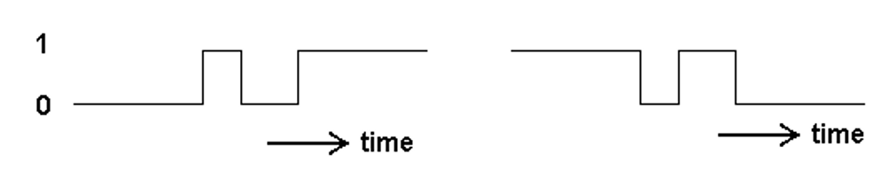
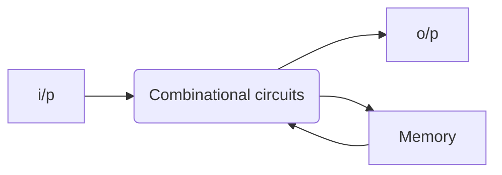

- Switching characteristics of semiconductor devices, TTL gate, CMOS gate.
- Flip-flop

# Logic Levels
The voltages used to represent logic 0 or 1 are called logic levels. 
- HIGH can be any voltage between a specified minimum and a specified maximum.
- LOW can be any voltage between a specified minimum and a specified maximum.
- No overlap between the accepted range of HIGH levels and the accepted range of LOW levels.

# Logic Families
## Bipolar IC Elements and Operations

The main elements of a bipolar IC are resistors, diodes (which are also capacitors) and transistors. Basically, there are two types of operations in bipolar ICs:

1. Saturated, and
2. Non-saturated.

In saturated logic, the transistors in the IC are driven to saturation, whereas in the case of non-saturated logic, the transistors are not driven into saturation.

## MOS Logic Families

MOS devices are unipolar devices and only MOSFETs are employed in MOS logic circuits.

The MOS logic families are:

1. PMOS,
2. NMOS, and
3. CMOS (5-V and low-voltage CMOS)

## Saturated Bipolar Logic Families
1. Resistor–transistor logic (RTL),
2. Direct–coupled transistor logic (DCTL),
3. Integrated–injection logic (I²L),
4. Diode–transistor logic (DTL),
5. High–threshold logic (HTL), and
6. Transistor–transistor logic (TTL).

## Non-Saturated Bipolar Logic Families
1. Schottky TTL, and
2. Emitter-coupled logic (ECL).

## Characteristics of Digital ICs

The various characteristics of digital ICs used to compare their performances are:

1. Speed of operation
    - $ t_{pHL} $: output HIGH to LOW propagation delay time,
    - $ t_{pLH} $: output LOW to HIGH propagation delay time,
2. Power dissipation,
    - $ V_{CC} $: supply voltage,
    - $ I_{CC} = \frac{I_{0} + I_{B}}{2} $: supply current,
    - $ P_{D} = V_{CC} \cdot I_{CC} $: power dissipation,
3. Figure of merit
    - $ Figure \ of \ Merit = \frac{P_{D}}{t_{pHL} + t_{pLH}} $
4. Fan-out
5. Current and voltage parameters,
6. Noise immunity,
7. Operating temperature range,
8. Power supply requirements, and
9. Flexibilities available.

Switching characteristics of semiconductor devices:
- Digital waveforms consist of voltage levels that are changing back and forth between the HIGH and LOW levels.
- **Rising edge** (or positive edge) happens when digital signal goes from LOW to HIGH.
- **Falling edge** (or negative edge) happens when digital signal goes from HIGH to LOW.
# Timing Diagram
A timing diagram is a graph of digital waveforms showing the actual time relationship of two or more waveforms and how each waveform changes in relation to the others.

# Sequential Logic Circuits
- Consists of both combinational logic circuits and memory elements.
- Memory elements are constructed **from bistable logic** circuits called ‘flip-flops’.
- Output depends on current inputs and previous output state.

- Synchronous Sequential Circuits: Outputs and state change depending on a special input (clock).
- Asynchronous Sequential Circuits: Outputs and state change as soon as an input changes.

## Bistable Elements
- Has two stable conditions (states).
- Can be used to store binary logic.
-  Q = high
    - feedback to inverter 2 will cause its output to be low
    - which also forces the output of inverter 1 to be high. 
- If Q = low
    - feedback to inverter 2 will cause its output to be high
    - which also forces the output of inverter 1 to be low. 

# Latches and Flip-flops
- Sequential circuits have outputs that depend on both the **present state** and the **sequence of past inputs**. To be able to remember past inputs, sequential circuits contain memory devices called **latches** and **flip-flops**.
- Both latches and flip-flops can be in one or more stable states (bistable) and have one or more inputs that can be used to change the outputs. 
- **Flip-flops** have **clock** inputs
-  **latches** have **no clock** inputs.
    - A latch is a type of bistable logic device.
    - Can reside in either one of its two states, SET or RESET.
    - SET: Q = 1
    - RESET: Q = 0

## SR Latch
Latch as level-sensitive device
-   Latch is a **level-sensitive device**, meaning the outputs change when the levels of the inputs change (LOW or HIGH).
- Another device we will look at in the next slide is flip-flop which is an ****edge sensitive** device.
- An ****edge sensitive** device means the outputs change at the edges of the triggering input called **clock (CLK)**.

### Active HIGH input SR (SET-RESET) latch
Formed with two cross-coupled NOR gates.

|S|R|Q||
|---|---|---|---|
|0|0|$Q_0$|No Change|
|0|1|0|Reset|
|1|0|1|Set|
|1|1|$Q = Q' = 0$|Invalid|

### Active LOW input S’R’ latch
Formed with two cross-coupled NAND gates.

|S’|R’|Q||
|---|---|---|---|
|0|0|1|Invalid|
|0|1|1|Set|
|1|0|0|Reset|
|1|1|0|Invalid|

### Gated SR Latch
- A gated latch requires and enable input EN for enable (G is also used to designate an enable input).
    - When EN is HIGH
        - the S and R inputs control the state of the latch just as discussed in previous slides.
        - functions normally as an SR latch
        
    - When EN is LOW
        - no change occurs.
        - the output Q does not change (the latch stores its previous output).
    - The input EN is to enable the latch to respond to new inputs S and R when the inputs S and R are ready.
Timing Diagram of a gated SR latch
### Gated D Latch
- A gated D latch has only one input D (data) and an input enable EN (enable).
- D input is HIGH, the EN input is HIGH
    - the latch will be set i.e. the Q output is HIGH.
- D input is LOW, EN is HIGH
    - the latch will reset i.e. Q = 0.
- When the EN is low
    - the output has no change.

# Flip-Flops
- **Controlled latches** are level-triggered. 
- **Flip-flops** are edge-triggered devices.
    - Positive Edge-triggered
    - Negative Edge-triggered: Has a not gate (bubble) at the clock input.
- A **flip-flop** is a bistable (two stable states) logic circuit that can store only one bit at a time, either a 1 or a 0.
- The output of a flip-flop indicates which bit it is storing.
- An **edge-triggered flip-flop** changes state either at the positive edge (rising edge) or at the negative edge (falling edge) of the clock pulse and is sensitive to its inputs only at this transition of the clock.

## Types of Flip-Flops
### D Flip-Flop
- D is HIGH
    - Q output goes HIGH on the triggering edge of the clock pulse
    - flip-flop is SET
- D is LOW
    - Q output goes LOW on the triggering edge of the clock pulse
    - flip-flop is RESET
- The flip-flop cannot change state except on the triggering edge of a clock pulse.

Positive Edge-triggered D Flip-Flop
|D|CLK|$Q$|$\overline{Q}$|Comments|
|---|---|---|---|---|
|0|$\uparrow$|0|1|RESET|
|1|$\uparrow$|1|0|SET|

The operation of a negative edge-triggered D flip-flop are the same as those of the positive edge-triggered device except that the falling edge of the clock pulse is the triggering edge.

### JK Flip-Flop
- J is HIGH, K is LOW
    - the Q output goes HIGH on the triggering edge of the clock pulse
    - the flip-flop is SET.
- J is LOW, K is HIGH
    - Q output goes LOW on the triggering edge of the clock pulse
    - the flip-flop is RESET. 
- J and K are both LOW
    - the output does not change from its prior state. It is in STORE operation.
- J and K are both HIGH
    - the flip-flop changes state. This is called TOGGLE mode.

| J(Set) | K(Reset) |$Q_n$ | $Q_{n+1}$ | operation  |
|---|---|---|------|------------|
| 0 | 0 | 0  | 0     | no change  |
| 0 | 0 | 1  | 1     | no change  |
| 0 | 1 | 0  | 0     | reset      |
| 0 | 1 | 1  | 0     | reset      |
| 1 | 0 | 0  | 1     | set        |
| 1 | 0 | 1  | 1     | set        |
| 1 | 1 | 0  | 1     | toggle     |
| 1 | 1 | 1  | 0     | toggle     |

$Q_{n+1} = J \overline{Q_n} + \overline{K} Q_n$ 
### T Flip-Flop (Toggle flip-flop)
- T flip-flop can be built from JK flip-flop or D flip-flop as shown below.
- Changes output state at every active clock edge if the input T = 1. 
- If T = 0, the output stays the same. 
- T flip-flops are often used as counters.

| T | Q | Q+ | Comments |
|---|---|---|---|
| 0 | 0 | 0 ||
| 0 | 1 | 1 ||
| 1 | 0 | 1 | Toggle |
| 1 | 1 | 0 | Toggle |
#### negative edge-triggered T flip-flop
### Flip-flop with asynchronous inputs
- The D flip-flop and JK flip-flop discussed previously are called **synchronous inputs** because data on these inputs are transferred to the flip-flop’s output only on the triggering edge of the clock pulse. Hence, data are transferred synchronously with the clock.
- Flip-flops can have **asynchronous inputs**. These are inputs that affect the state of the flip-flop independent of the clock.
- They are normally labelled preset (PRE) and clear (CLR).
#### D flip-flop with asynchronous PRESET and CLEAR inputs
- A D flip-flop with asynchronous PRESET and CLEAR inputs are shown below.
- These inputs are active LOW (indicated by bubbles).
- These inputs must be kept HIGH for synchronous operation.

Timing Diagram 
- When active-LOW PRESET = 0, the output of D flip-flop is SET (Q=1).
- Active-LOW CLEAR = 0, the output of D flip-flop is RESET or CLEAR (Q=0).
- When active-LOW CLEAR and PRESET are both HIGH, normal synchronous operation of D flip-flop takes place.
|active-LOW PRESET|active-LOW CLEAR|D|CLK|Q|Comments|

### Flip-Flop Characteristic Equations
$ Q_{n+1} = D $
|D|$Q_{n+1}$|
|---|---|
|0|0|
|1|1|

$ Q_{n+1} = J \overline{Q_n} + \overline{K} Q_n $
|J|K|$Q_{n+1}$|
|---|---|---|
|0|0|$Q_n$|
|0|1|0|
|1|0|1|
|1|1|$Q_n'$|

$ Q_{n+1} = T ⊕ Q_n'$
|T|$Q_{n+1}$|
|---|---|
|0|$Q_n$|
|1|$Q_n'$|

# Propagation Delay
- The interval of time required after an input signal has been applied for the resulting output change to occur.
1. Propagation delay $ t_{PLH} $ as measured from the triggering edge of clock pulse to the LOW-to-HIGH transition at the output. See figure (a) in the next slide.
2. Propagation delay $ t_{PHL} $ as measured from the triggering edge of clock pulse to the HIGH-to-LOW  transition at the output. See figure (b) in the next slide.
