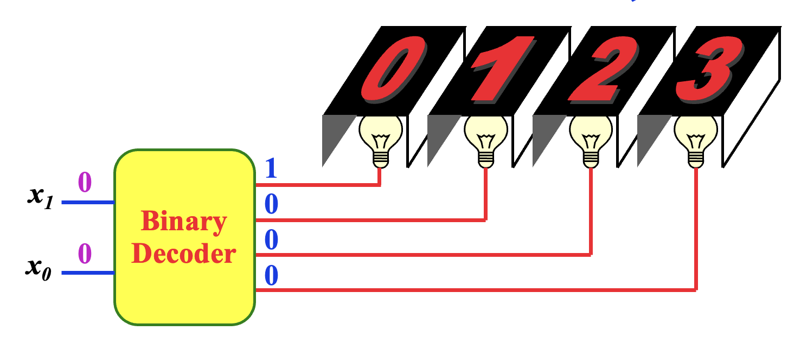
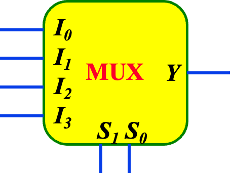
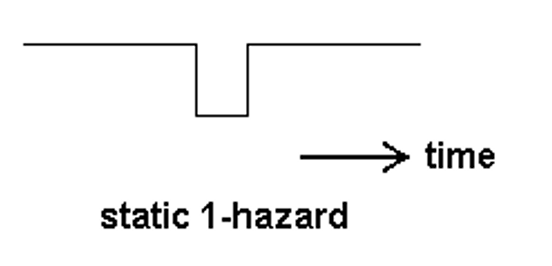

# To BCD
$ 42 = 0100\ 0010_BCD $\
$ 

# To BCD Equivalent
$ 1010110_2 = 86_{10} = 1000\ 0110_BCD $\
$ 1100100.11_2 = 100.75_{10} = (0001 0000 0000.0111 0101)_{BCD} $
# Addition

# Binary to Gray Code
