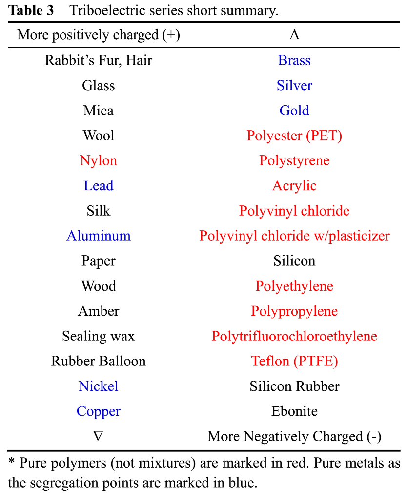

Key Questions
-  What are two ways to give objects a net charge?
-  How do we find the magnitude and direction of the electrostatic force exerted by one charged object on another?
-  Why do charged objects attract neutral ones?

# Electric Forces
The 4 fundamental forces
- Gravitational Force: Attractive force between masses
- Electromagnetic Force: Force between charged objects
- Strong Nuclear Force: Force that holds atomic nuclei together
- Weak Nuclear Force: Force responsible for radioactive decay

# Electric Charge
Electric Charge is the intrinsic property of protons and electrons, which make up all matter, is electric charge.
- Proton: Positive charge
- Electron: Negative charge
- SI unit of charge is the Coulomb (C): $ 1 \text{ C} = 1 \text{ A} \cdot \text{ s} $
- Electric charge is quantized, meaning it comes in discrete amounts. 
- The elementary charge (e) is the smallest unit of charge:
$ e = 1.602 \times 10^{-19} \text{ C} $

- -e : electron，muon，tauon
- +e : proton，positron
- 0e : neutron，photon，neutrino

Any electric charge, q, occurs as integer, N multiples of the elementary charge e.

# Static Electricity
## Electron Flow within a object
- What is static electricity?
- How is it produced?
- How does it behave?
- Does it have any uses?
- Is it dangerous?

Glass is not the only material that can be charged by rubbing. You may have experienced these yourself; when running a plastic or rubber comb through your hair, little bits of stuff can be picked up by static electricity. Or, after rubbing a balloon on your hair or a wool sweater, it will stick to the wall. Charging an object by rubbing is called triboelectricity, and materials such as these are on the opposite end of the triboelectric series or scale from glass. In general, it’s typically electrons that are transferred.

Charging an object by rubbing is called triboelectricity:
- Rubbing the glass.
- when running a plastic or rubber comb through your hair, little bits of stuff can be picked up by static electricity.
- after rubbing a balloon on your hair or a wool sweater, it will stick to the wall.

In general, it’s typically electrons that are transferred.

Static electricity is based on negative electrons and positive protons. 
positive designation established by Franklin: After rubbing with silk, becomes positively charged. The extra electrons in the silk give it a negative charge, and the lack of electrons leaves protons on the glass without complementary electrons, so it has a net positive charge. Thus, positive charge on an object is either an excess of protons or a lack of electrons, and negative charge just indicates more electrons than protons.

- Static electricity can be hazardous
    - Fires and explosions at gasoline pumps are a serious problem, and far too common. These incidents tend to happen when vapors are ignited, and can lead to vehicle damage—even casuing damage to the while gas station, and in too many instances, severe burns and fatalities.. Investigation were conducted after various such fires were reported in just a four-month period. They found several themes emerge, but none of these seemed to be caused by the use of cell phones. Instead, they noted that people would start fueling, get back in the car and maybe slide a little on the seat getting in and out, and then go back to the pump handle when they had finished filling. A touch of the pump handle, and the fire ignites—and often they heard a popping sound or felt a shock just prior to ignition. And, they typically wore rubber-soled shoes.
- Static electricity can be entertaining
    -  This illustration of a party in 1746 shows a boy, suspended by silk rope from a stick, attracting bits of paper. The boy has been electrically charged. The woman about to touch his nose will get a little electric shock as she discharges him—the touch allows his charge to flow through her to ground, because she is not electrically isolated like he is. 
    
    In the mid-1700’s, demonstrations of static electricity were really quite popular at parties and social gatherings. Benjamin Franklin was among those who attended and hosted these parties, and he pursued a careful investigation of these electric effects—the word electric comes from the Greek word for amber, which is one of the materials that shows electric effects when rubbed. You can also use glass. If you rub glass with silk, the glass becomes charged. Franklin suggested that the rubbing transfers an invisible electric fluid from the silk to the glass, so after rubbing, he would say that the glass is positively charged—it has extra electric fluid. The silk gave up some of its electric fluid, so we would call it negatively charged.
    
Our modern-day explanation of static electricity keeps the positive designation established by Franklin. After rubbing with silk, glass becomes positively charged. But instead of talking about an excess or deficit of fluid, we now explain that electrons have been transferred from the glass to the silk. The extra electrons in the silk give it a negative charge, and the lack of electrons leaves protons on the glass without complementary electrons, so it has a net positive charge. Thus, positive charge on an object is either an excess of protons or a lack of electrons, and negative charge just indicates more electrons than protons.

Triboelectricity is the tendency of the material to release or accept electron.

[Intended line of reasoning: It’s probably a kind of plastic material, which you might guess would pick up a negative charge. You could test it by bringing it close to a known charged object, and carefully determining the direction of force. For example, you could bring the pen close to a suspended charged plastic comb, which you know is negative. If they repel each other, the pen is also negative.] 

- Triboelectricity self charging droplet capacitor
- Triboelectricity Nanogenerator

Charges move more easily through a conductor than an insulator

## Electron Flow within a object
- Conductors: high conductivity, electrons move freely
    - Most Metals (Bronze)
- Insulators: low conductivity, electrons are bound to atoms
    - Rubber
Rubber is a good insulator. When you charge one end of a rubber rod by rubbing, the excess electrons tend to stay in place at that end of the rod. On the other hand, copper is a good conductor, and any charge that is transferred by rubbing tends to flow easily along the rod, even into your hand and out of the rod. Thus, it’s possible to charge a conductor, but it must be a conductor that is isolated from the environment by insulators. 

At this point, you may be thinking, why would the excess electrons want to flow through the copper rod? Because it’s a conductor, charge is able to flow, but that doesn’t explain why it would flow. It’s as if these excess electrons don’t want to be near each other. In fact, they actually repel each other with the electric force. Let’s talk more about that on the next slide…
### Insulators and conductors are different at the microscopic level

Part 2
- Coulomb's Law
    - $ F = k \frac{|q_1 q_2|}{r^2} $
    - $ k = 8.99 \times 10^9 \text{ N} \cdot \text{ m}^2/\text{C}^2 $
- Inverse square, like gravity
    - $ F = G \frac{m_1 m_2}{r^2} $

Direction rules
- Attracted
- Repelled

Modeling
- 2 spherical shells
- 2 solid spheres
- 2 pointlike objects or 2 particles
- 1 particle and 1 spherical shell

we can use Coulomb’s law with an object that has spherical symmetry in the charge distribution
## Vector
- is a quantity that has a magnitude (size) AND a direction.
- can be in one-dimension, two-dimensions, or even three-dimensions
- can be represented using a magnitude and an angle measured from a specified reference 
- can also be represented using unit vectors 

$ \vec{A} = A \hat A $
- $ A $ Magnitude
- $ \hat A $ Unit vector
    - A unit vector is a vector that has a magnitude of 1 unit
    - x: $ \hat i $
    - y: $ \hat j $
    - z: $ \hat k $
- Magnitude：
    - $ |A| = \sqrt{A_x^2 + A_y^2 + A_z^2} $  

Correct form
- $ F = G - F $
- $ F = 1 \text{ N} $
- $ B = 5 \text{ Gauss} $
- $ \vec F = \vec G - \vec F $
- $ \vec F = 2 \vec i + 3 \vec j \text{ (N)} $
- $ \vec B = 4 \text{ Gauss, in } x \text{ direction} $

$ \vec F_{tot} = (F_1x + F_2x + F_3x) \hat i + (F_1y + F_2y + F_3y) \hat j = (F_1 \cos \theta + F_2 \cos \theta) \hat i + (F_1 \sin \theta + F_2 \sin \theta) \hat j $