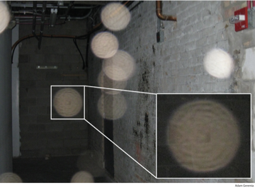
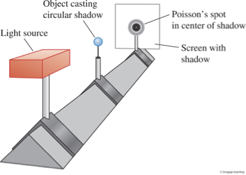
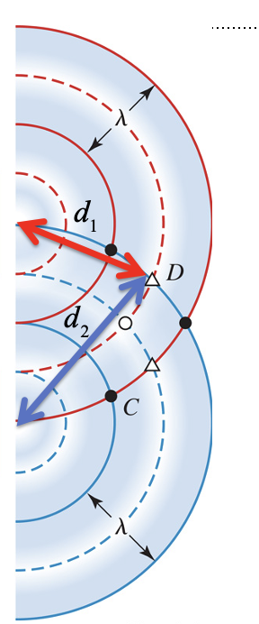
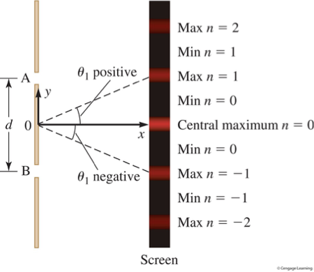
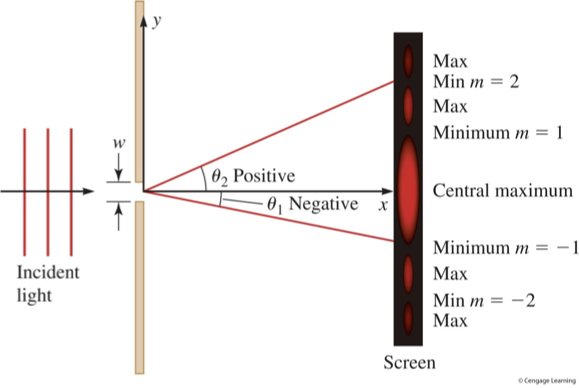
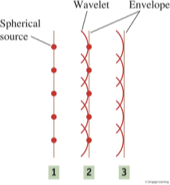

- What evidence supports the wave model for light?
- How do we find the location and intensity of the fringes in interference and diffraction patterns?

Many important figures through history thought of light as a particle

To find wave behavior of light, we must carefully seek out details on a finer scale

On the other hand, waves like those we studied in Chapter 18 tend to spread out when they pass through an opening, or propagate past the edge of a barrier. This is called diffraction, if you recall, and with interference—constructive and destructive—is a property of mechanical waves.

Now, we know after studying Maxwell’s equations that light is an electromagnetic wave. 

It turns out that in order to observe wave effects, namely diffraction and interference, the size of the apertures must be on the order of several wavelengths. The wavelength of visible light is really small, 400 to 700 nanometers. Other electromagnetic waves, like radio waves or microwaves, have more human-scale wavelengths, but our eyes are not sensitive to these wavelengths. 

Also, it helps to have light of just one color—now associated with one frequency or one wavelength—to demonstrate these wave phenomena. Using just red light, for example, and tiny holes that are closer to the wavelength of light, around 1 micrometer or so, or maybe hundredths of millimeters, we do see wave effects. Red light from a laser was used to produce these diffraction patterns from the circular and square apertures. 

Weird wave effects have intrigued scientists for centuries
- A zoomed-in view of one of them shows that there are rings within the orb; this will become a telltale sign of interference effects, a phenomenon that is inherent to waves—but not particles. 

- the theory predicted there would be a bright spot in the center of the shadow cast by a circular object. For adherents to the particle theory, this bright spot seemed impossible, and it’s counterintuitive, but it did. 

## Interference of waves occurs with sound, with constructive and destructive interference
- Path difference: $ \Delta d = d_2 - d_1 $

Young’s experiment of 1803 showed nice wave properties of light, under four conditions

- Same frequency
- Constant relative phase
## Apply Huygens’s principle to see the diffraction of waves around barriers 

- $ \Delta d = n \lambda $
- Central Maximum
    - $ \Delta d = 0 $
    - $ n = 0 $
- $ \sin \theta = \frac{opp}{hyp} = \frac{\Delta d}{d} $
- Approximation: $ \sin \theta \approx \frac{y}{x} $ 
- Constructive interference: $ \Delta d = n \lambda = d \sin \theta $
- Destructive interference: $ \Delta d = (n + \frac{1}{2}) \lambda = d \sin \theta $
- $ n = \pm 0, \pm 1, \pm 2, ... $

# Chapter summary
**Huygens’s Principle**: Each point on a primary wave front serves as a source of wavelets that combine to give an envelope that is the wave front at some later time.

1. Diffraction – bright and dark areas, occurring when waves pass through a narrow opening or around a barrier
2. Interference – wave phenomenon with bright and dark fringes, formed by superposition of two or more waves
3. Conditions for constructive and destructive interference
- Constructive: $ 0° $ phase: $ \Delta d = n \lambda , n = 0, 1, 2, ... $
- Destructive: $ 180° $ phase: $ \Delta d = (n + \frac{1}{2}) \lambda , n = 0, 1, 2, ... $
4. Coherent light waves: monochromatic and constant phase difference

1. Young’s double-slit (interference)
