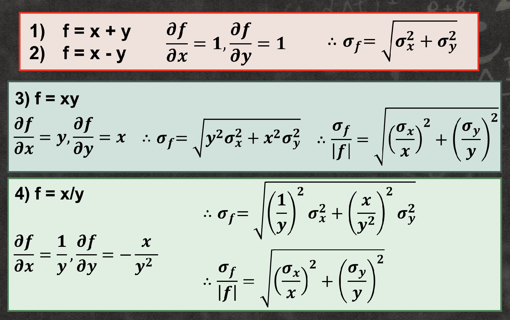

# Part I : Express number properly
## Significant Figures
- $ 5.34 \rightarrow 3 \text{ significant figures} $
- $ 0.080 \rightarrow 2 \text{ significant figures} $
# Part II: Systematic and random errors
## Systematic Errors
- Shift measurements from their true value by the same amount or fraction in the same direction all the time. 
- Not affect the precision 
- Affect the accuracy.
- From
    - A mis-calibrated device, or
    - A measuring technique which always makes the measured value larger/smaller than the "true" value.
- Example
    - Using a steel ruler at liquid nitrogen temperature to measure the length of a rod.
    - The ruler will contract at low temperatures and therefore overestimate the true length.
- Careful design of an experiment will allow us to eliminate or to correct for systematic errors.
- Rule of Thumb
    - Determine the uncertainty from measurement tools.
    - Digital instrument
        - The uncertainty = the minimum scale
    - Analog instrument
        - The uncertainty = the minimum scale
        - The uncertainty = the minimum scale/2
    Are acceptable.
## Random Errors
- Shift each measurement from its true value by a random amount and in random direction.
- Affect the precision.
- May not affect the overall accuracy.
- Error is the discrepancy of a measured value from the true value.
- Uncertainty is the range of the possible errors for a measured value.
- Result of a measurement: $ x = x_0 \pm \Delta x $
    - $ x_0 $: the measured value
    - $ \Delta x $: the uncertainty
- Measurement
    - Single measurement: $ x = x_0 \pm \Delta x_{sys} $
        - $ \Delta x_{sys} $: Minimum scale of the instrument
    - Multiple measurements: $ x = x_{measured} \pm \Delta x $
        - $ x_{measured} $: Mean of the measurements
        - $ \Delta x = \sqrt{(\Delta x_{sys})^2 + (standard\ error)^2}$: Combined uncertainty
    - Sample Mean: $ \bar{x} = \frac{1}{n} \sum_{i=1}^{n} x_i $
    - Standard Deviation: $ s = \sqrt{\frac{1}{n-1} \sum_{i=1}^{n} (x_i - \bar{x})^2} $
    - Standard Error: $ SE = \frac{s}{\sqrt{n}} $
    - Combined Uncertainty: $ \Delta x = \sqrt{(\Delta x_{sys})^2 + (SE)^2} $
### Rules for Stating Uncertainty
- Uncertainty can be expressed in one significant figure.
- $ 0.32 \rightarrow 0.4 $
- $ 72.6 \pm 0.4 $
- Accuracy: Closeness to the true value.
- Precision: Groupness of repeated measurements.
## Percentage of Error
- $  \text{Percentage Error}(\%) = \frac{|x_{measured} - x_{true}|}{|x_{true}|} \times 100\% $
## Relative Uncertainty
- $ \text{Relative Uncertainty} = \frac{\Delta x}{x_{measured}} \times 100\% $
## Percentage Difference
- $  \text{Percentage of Difference}(\%) = | \frac{E_{1} - E_{2}}{\frac{E_{1} + E_{2}}{2}} | \times 100\% $
## Propagation of Error
- Direct Measurements:  
    - measuring exactly the physical quantity that you're looking to measure
- Indirect Measurements
    - measuring the actual physical quantity by
measuring something else
    - calculated using formula

