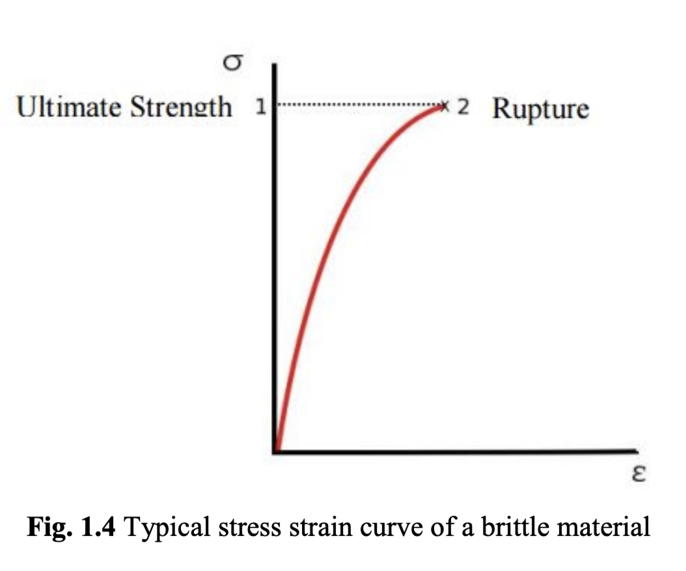
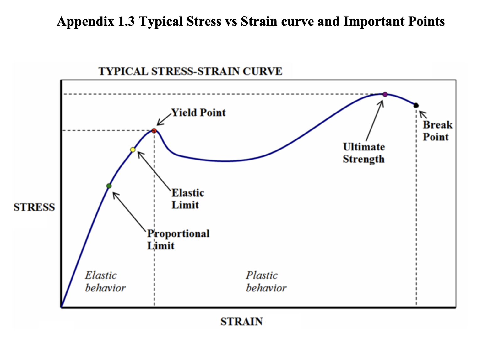

# Objective:
1. To find the relationship between tensile stress and strain for the given materials.
2. To ascertain modulus of elasticity, elastic region, plastic region, yield point and the break point parameters from a plot of stress versus strain.
3. To understand the type and sources of experimental errors
4. To clearly and correctly report measurements and the uncertainties in those measurements.

# Young’s modulus ($E$)
- Deformation of a material in response to an applied force. 
- When a solid is stretched, compressed, or deformed in some other way, it is said to contain a strain. 
- To produce a strain in a solid one must apply some force to the solid. 
- 
The amount of the rotation is proportional to the distance the wire stretches. The strain is found by the stretch of the wire divided by the initial length of the wire while to find the stress we used the amount of force applied divided by the cross-sectional area of the wire. The stress versus strain graph is then plotted and visualized via CAPSTONE® Software and the Young’s Modulus is therefore can be calculated by determining the slope of the stress versus strain graph.
# Theory
- brittle specimen
- ductile specimen
## Ductile Materials
A ductile material is any material that can be subjected to large strains before it rapture. 
- Percent elongation(PE): $ PE = \frac{l_f - l_0}{l_0} \times 100 $
- Percent reduction in area (PRA): $ PRA = \frac{A_0 - A}{A_0} \times 100\% $

## Typical stress strain curve of a ductile material
- Ultimate Strength
- Yield Strength
- Proportional Limit Stress
- Rupture
- Offset Strain (typically 0.002)
## Brittle Materials
A brittle material exhibits little or no yielding before failure. Brittle materials do not have well
defined tensile fracture stress, since the appearance of initial cracks in a specimen is quite
random and lead to complete sudden fracture. In a tension test, brittle material fracture when
normal stress reaches the ultimate stress $\sigma_u$.
## The Stress-Strain Relations
- Normal/Engineering stress: $ \sigma = \frac{F}{A_0} $
- Normal/Engineering strain: $ \epsilon = \frac{L - L_0}{L_0} = \frac{\Delta L}{L_0} $
- Change in the specimen's gage length: $ \Delta L = L - L_0 $
- Young's Modulus: $ E = \frac{\sigma}{\epsilon} $
- Hooke's Law: $ \sigma = E \epsilon $

- Brittle materials such as concrete and carbon fiber do not have a yield point, and do not strainharden which means that the ultimate strength and breaking strength are the same. 

# Questions
## 1. Determine the type of materials being tested – Is it brittle or ductile? Explain why.
## 2. Compare the modulus for the as-obtained experimental value with the sample value provided in Appendix 1.3 with respect to their Young’s Modulus and yield points. Include an explanation on the changes occurred to the gauge length at the atomic level.
## 3. Define mechanical stress in your own words and include a sketch. Discuss what is physically happening to a coupon when it is experiencing stress.
## 4. Identify the part of the samples with large deformation or damage or broken, try to explain why this part is the weak point of the sample.