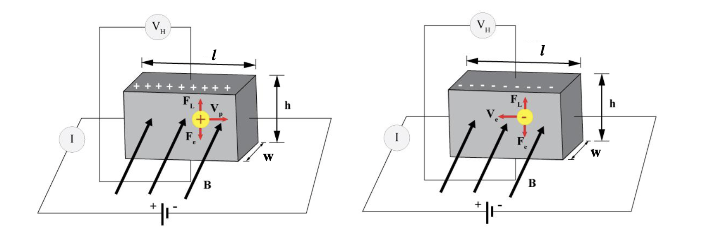

# Objective
1. To explain Hall effect in extrinsic semiconducting sample
2. To research the relationship between Hall voltage (VH) and magnetic field (B)
3. To calculate the density of electrons and drift velocity of dopants in semiconducting sample.
4. To measure Hall coefficient in the given semiconducting sample
5. To determine the uncertainty values for $ R_H $, $ V_d $ and $ n_s $.
# Introduction
The Hall Effect is the production of a voltage difference (Hall voltage/Hall emf, $ V_H $) across an electrical conductor, transverse to an electric current in the conductor and a magnetic field perpendicular to the current. 
# Theory
- A current passes through a conducting material along the X direction 
- A magnetic field in the Y direction 
- A potential difference $V_H$ appears along the Z axis, that is between the faces C & D of the material. 
- A charge $e^-$ moves with velocity $v_d$ through a magnetic field $B$ then a force $\vec{F}$ acts on the charge, where $ \vec{F} = e \vec{v_d} \times \vec{B} $.
- The Hall Effect is observed when a magnetic field is applied at right angles to a rectangular sample of material carrying an electric current. A voltage appears across the sample that is due to an electric field that is at right angles to both the current and the applied magnetic field. The Hall Effect can be easily understood by looking at the Lorentz force on the current carrying electrons. 

- $ e\vec{v_d}\times\vec{B} = \vec{E_H} $
- $ V_H = \vec{E_H} \cdot d $
- $ h $: Thickness of the crystal in the Z-direction
- $ n $: Number of electrons per unit volume
- $ A = wh $: Cross-sectional area of the conductor

| Property | Formula |
|---|---|
|Mobility|$ \mu = \frac{e}{m} $|

# Questions
## 1. Calculate the mean of $ R_H $, $ V_d $, $ n_s $ value and state the uncertainty in the measurement of these values.
## 2. What are the experimental errors that you encountered while conducting this experiment?
## 3. State the uncertainties in the measurement of the Hall Effect voltage, the current through the sample, the magnetic field and the distance between the contact points?
## 4. What is a semiconductor? What are p and n type semiconductors? Give one example of each.