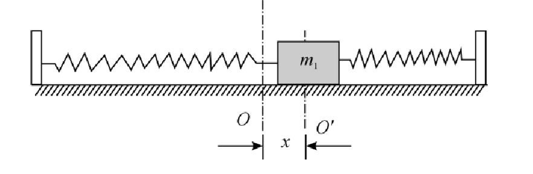

# Objective
1. To investigate the relationship between the period $T$ and amplitude $A$ of an oscillating system and determine the spring constant $k$.
2. To determine the spring constant $k$ and mass of springs $m$ using graphical method.
# Introduction
Oscillation is one of the most common natural phenomena. Simple harmonic motion is one of the most fundamental and simplest oscillation. It serves as a good model for the study of electromagnetic, solid and liquid oscillating systems. This experiment uses spring oscillator to model simple harmonic motion.
# Theory
- Spring constant: A parameter that states the properties of a spring.
- Under an external force, the deformation of shape, period of oscillation, frequency of oscillation of the spring are all
attributed to the spring constant.
## Hooke’s Law
- $F = -kx$
- within the limit of proportionality, - Extension of spring, $ x $ is directly proportional to force, $ F $ exerted by the spring when it is stretched or compressed.
## Simple harmonic motion equation of spring oscillator

- According to Newton's second law:
    - $ -k_1(x + x_1) - k_2(x - x_2) = m\frac{d^2x}{dt^2} $
    - $ -(k_1 + k_2)x = m\frac{d^2x}{dt^2} $
- $ m = m_1 + m_0 $
    - $ m_1 $: effective mass of the spring
    - $ m_0 $: effective mass of the cart
    - When $ m_s \ll m_1 $, $ m_0 = \frac{m_s}{3} $
- $ x = A\sin(\omega t + \phi) $
    - $ \omega = \sqrt{\frac{k_1 + k_2}{m}} $: the angular frequency of the oscillation
    - $ A $: the amplitude
    - $ \phi $: the initial phase
- $ T = \frac{2\pi}{\omega} = 2\pi\sqrt{\frac{m}{k_1 + k_2}} $
