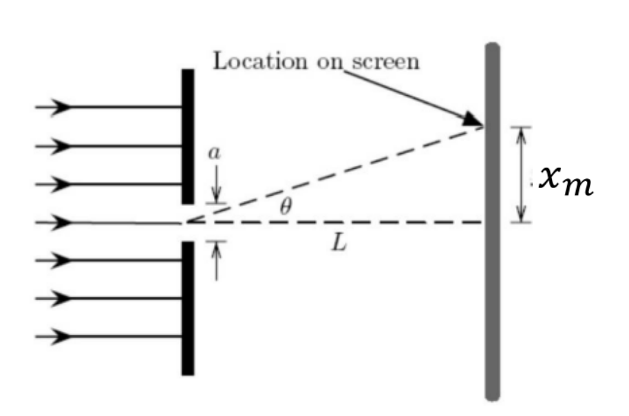
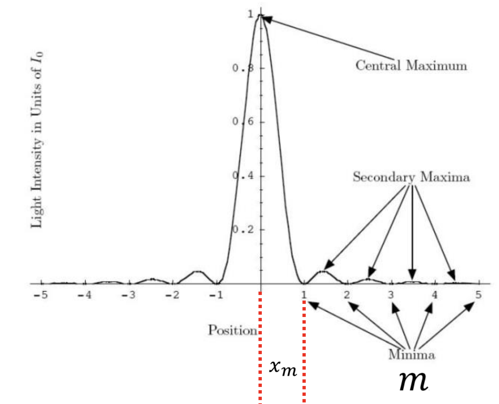

- Electromagnetic radiation
    - Light
    - wavelength and frequency: Color
        - wave-like
        - particle-like
    - Diffraction
        - Constructive interference and 
        - destructive interference
        - $ m \lambda = a \sin \theta = a \tan \theta = \frac {a x_m} {L} $
        - $ m \lambda = \frac {a (2 x_m)} {L} $
            - $ \lambda $: Wavelength
            - $ a $: Slit width
            - $ L $: Distance from slit to screen
            - $ x_m $: Distance from the center of the central maximum to the m-th order minimum
        

- Calculate...
- Illustrate (draw) and explain...
- Justify...

# Questions
1. The manufacturer of the slits claims the uncertainty in the slit width is 0.0005 mm. 
    1. Do your results agree with this? 
        - My results don’t agree with this.
    2. Compare the slit width you determined with the slit width given. 
    3. Give the reason if you got discrepancy in the result.
        - Slit‐to‐sensor alignment error: Any tilt or offset shifts fringe positions systematically.
        - Finite laser beam divergence: A non–perfectly collimated beam slightly alters the fringe angles.
        - Distance measurement error: A ±1 mm error in the slit–sensor distance propagates into the calculated width.
    2. 
        1. How does the single slit pattern change as you decrease the slit size?
            - $ \sin \theta = \frac {m \lambda} {a} $
            - Slit size decreases
            - the diffraction pattern spreads out more
            - The central maximum widens
            - the minima are spaced farther apart.
    3. Human hair ranging from 20 μm to 200 μm. 
        1. Does the thickness of the hair strand you determined fall within this range?
            - Yes
        2. Compare also the obtained hair thickness from diffraction experiment and micrometer.
        3. Give the reason if you got discrepancy in the result.
            - The hair is not perfectly cylindrical: Hair may be slightly oval, so the diffraction “effective width” can differ.
            - Hair curvature or tilt: A non-perfectly straight strand effectively lengthens the path.
            - Measurement errors with the micrometer: A slight micrometer error may lead to overall error.
        4. Are there any differences in the shape of the peaks obtained in Part A and Part B, particularly among the central maxima peaks? Discuss the differences observed.
            - The slit pattern shows a broader central maximum with visible secondary maxima, typical of single-slit diffraction.
            - The hair patterns exhibit narrower, sharper central maxima, reflecting the hair's thinner, less uniform structure acting as a diffracting edge or obstacle.
            - Sensitivity: As sensitivity increases from 0-1 to 0-10,000, the central maximum becomes narrower and more intense, with less detail in secondary maxima. The 0-1 range provides a broader view of the diffraction envelope, while 0-100 and 0-10,000 focus on the peak's intensity, potentially saturating or obscuring secondary features.
        5. Can this experiment be used to determine the wavelength of a multi-wavelength light source? Briefly explain your answer. This experiment cannot be used to determine the wavelength of a multi-wavelength light source.
            - With monochromatic light, the diffraction pattern is clear and wavelength-specific. With two or more wavelengths present, each produces its own overlapping diffraction pattern. The fringes from different colors blur together, minima fill in, and you cannot unambiguously assign a given fringe spacing to a single $ \lambda $.