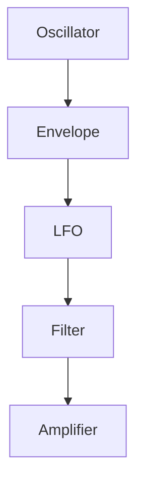

- Analog
    - Subtractive: Retro
        - Frequency
        - Envelope ADSR
    - Additive: Multiple sine waves in different frequencies $ f_n, r_n $ 
    - Wavetable(Serum) can replace subtractive.
- Digital
    - Frequency Modulation (FM): Use one oscillator to modulate the frequency of another.
    - Granular

ASDR
- Attack
- Decay
- Sustain
- Release

Modulation
- OSC
    - Sine
    - Triangle
    - Square
    - Sawtooth
    - Noise
- Envelope
- LFO: < 40 Hz to 
- Filter: Cut off frequency
- AMP: Electric signal to sound wave

- Amplitude: Louder, softer
- Pitch: Highness, lowness
- Theremin: played with two controls: pitch and amplitude.
brightness,” “movement,”

- Envelope: The shape of a sound changing over time.
- ADSR
    - Attack
    - Decay
    - Sustain
    - Release
- Height: Amplitude
- Shape: 

Synthesizer use Oscilator to create envelope.
Low Frequency Oscillator (LFO)

audio oscillators
- wave shape: timbre
    - square waves: “woody” or “hollow”
    - saw waves: “buzzy” or “bright.”
- Rate: Frequency(hertz): Pitch
- Amount: 
- Pulse width: the amount of time the oscillator spends in the high and low part of its cycle.
    - The wave has its “fullest” sound at the center, where the waveform is symmetrical.
- the LFO gets faster, the individual cycles of the LFO start to sound like they’re “blurring” together.The changes in pitch start to sound like changes in timbre, resulting in a “harsh” or “metallic” sound.slow modulations are usually perceived as changes to behavior (changes that are applied to the sound), while fast modulations are usually perceived as changes to timbre (changes to the character of the sound itself).
- Filter: 
    - Cut off frequency
        - high frequencies make a sound “brighter.” 
        - Less high frequencies make it “darker.”
        - Low-pass filter
        - High-pass filter
        - Band-pass filter: Allow a specific range of frequencies to pass through.
    - resonance: increases the amplitude around the cutoff frequency
        - High resonance values create a kind of high “whistling” sound. 