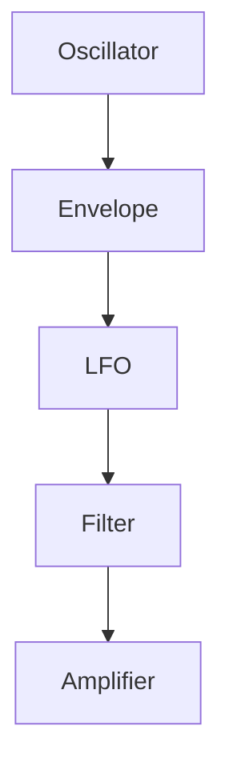

- Analog
    - Subtractive: Retro
        - Frequency
        - Envelope ADSR
    - Additive: Multiple sine waves in different frequencies $ f_n, r_n $ 
    - Wavetable(Serum) can replace subtractive.
- Digital
    - Frequency Modulation (FM): Use one oscillator to modulate the frequency of another.
    - Granular

ASDR
- Attack
- Decay
- Sustain
- Release

Modulation
- OSC
    - Sine
    - Triangle
    - Square
    - Sawtooth
    - Noise
- Envelope
- LFO: < 40 Hz to 
- Filter: Cut off frequency
- AMP: Electric signal to sound wave

- Amplitude: Louder, softer
- Pitch: Highness, lowness
- Theremin: played with two controls: pitch and amplitude.
brightness,” “movement,”

- Envelope: The shape of a sound changing over time.
- ADSR
    - Attack
    - Decay
    - Sustain
    - Release