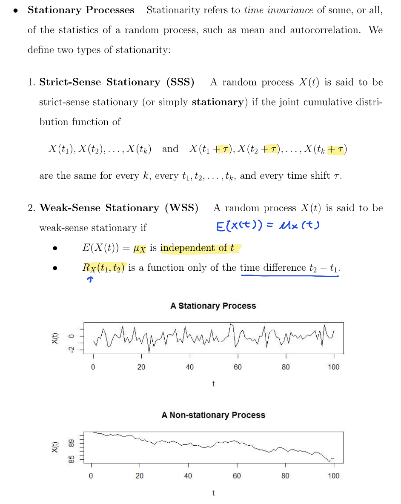

# 5.1 Basic Concepts of Stochastic Processes
- **Random Process**: A collection of random variables indexed by time or space: $\{S(t), t \in T\}$
    - **Continuous-Time**: $\{X(t), t \in I\}$, $I$ is an interval.
    - **Discrete-Time**: $\{X(n) = X_n, n \in I\}$, $I$ is a set of integers.
- **State Space**: The set of all possible values.
- Sample Function/Sample Path/Realization: A single realization of the random process of $X(t)$.
- Mean Function: $\mu(t) = E[X(t)]$
- Autocorrelation Function: $R_X(t_1, t_2) = E[X(t_1)X(t_2)]$
- Autocovariance Function: $C_X(t_1, t_2) = \text{Cov}(X(t_1), X(t_2)) = E[X(t_1)X(t_2)] - E[X(t_1)]E[X(t_2)] = E[(X(t_1) - \mu(t_2)(X(t_2) - \mu(t_2))]$
- $t_1 = t_2$
    - $R_X(t, t) = E[X^2(t)]$
    - $C_X(t, t) = \text{Var}(X(t))$
- X(t_1) and X(t_2) are Positive Correlated if $C_X(t_1, t_2) > 0$.
- X(t_1) and X(t_2) are Negative Correlated if $C_X(t_1, t_2) < 0$.
- X(t_1) and X(t_2) are Uncorrelated if $C_X(t_1, t_2) = 0$.
## Multi
- Cross Correlation: $R_{XY}(t_1, t_2) = E[X(t_1)Y(t_2)]$
- Cross Covariance: $C_{XY}(t_1, t_2) = \text{Cov}(X(t_1), Y(t_2)) = E[X(t_1)Y(t_2)] - \mu_X(t_1)\mu_Y(t_2)$
## Stationary Process
1. Strict-Sense Stationary (SSS):
2. Wide-Sense Stationary (WSS):

# 5.2 Gaussian Random Process
- $X(t_n)$ are jointly normal.
# 5.3 Poisson Process
- Counting process: $N(t)$ counts the number of events that occur in the interval $[0, t]$.

