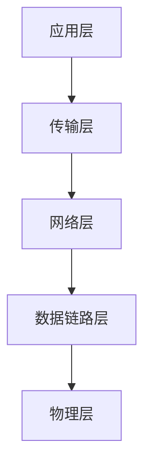

# 2.1 TCP/IP 网络模型有哪几层？

- TCP/IP 网络模型什么用：通用的网络协议
- 应用层（Application Layer）
- 传输层（Transport Layer）
    - 两个传输协议
        - TCP（Transmission Control Protocol）
        - UDP（User Datagram Protocol）
- 网络层（Network Layer）
- 数据链路层（Data Link Layer）
- 物理层（Physical Layer）